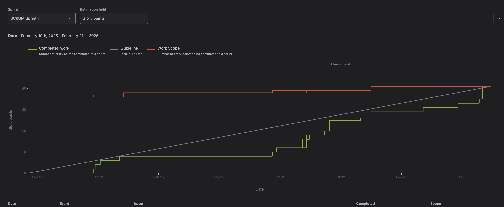
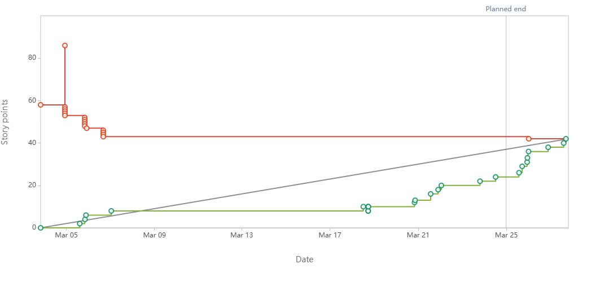
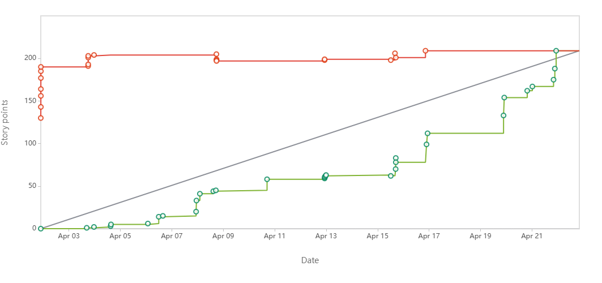

# CookCompass

Team Members:

    Brandon Stewart

    Jackson Berdou

    Samuel Castillo

    Ethan Bogart

## Table of Contents

- [General Info](#general-information)
- [Technologies Used](#technologies-used)
- [Features](#features)
- [Screenshots](#screenshots)
- [Setup](#setup)
- [Usage](#usage)
- [Project Status](#project-status)
- [Room for Improvement](#room-for-improvement)
- [Acknowledgements](#acknowledgements)
- [Contact](#contact)
<!-- * [License](#license) -->

## General Information

- What you’re creating?

  - An app to help find recipies given what ingredents are available.

- Why you’re doing this, the impact or change you hope to make?
  - Reduce food waste.
  - Improve efficiency in the kitchen.
  - Help people make tasty meals at home.
- Who you’re doing it for, your audience
  - For people who may struggle with cooking.
  - Recipie ideas for inexperienced/experienced cooks.

<!-- You don't have to answer all the questions - just the ones relevant to your project. -->

## Technologies Used

- [React (Frontend)](https://react.dev/)
- [Node.js with Express.js (Backend)](https://expressjs.com/)
- [MongoDB (Database)](https://www.mongodb.com/)

## Features

Sprint 1

Contributions
**Ethan**-"Created a way to find recipes based on Available ingredients"

- 'Jira Task - UI Design for Ingredient Selection (Design)'
  - [SCRUM-39](https://cs3398-miranda-spring.atlassian.net/jira/software/projects/SCRUM/boards/1?issueParent=10035&selectedIssue=SCRUM-39) [Repo](https://bitbucket.org/cs3398-miranda-s25/project-cs3398/branch/SCRUM-39-ui-design-for-ingredient-select)
- 'Jira Task - Backend Route for Recipe Retrieval (Implementation)'
  - [SCRUM-40](https://cs3398-miranda-spring.atlassian.net/jira/software/projects/SCRUM/boards/1?issueParent=10035&selectedIssue=SCRUM-40) [Repo](https://bitbucket.org/cs3398-miranda-s25/project-cs3398/branch/SCRUM-40-backend-route-for-recipe-retrie)
- 'Jira Task - Frontend Integration with API (Implementation)'
  - [SCRUM-41](https://cs3398-miranda-spring.atlassian.net/jira/software/projects/SCRUM/boards/1?issueParent=10035&selectedIssue=SCRUM-41) [Repo](https://bitbucket.org/cs3398-miranda-s25/project-cs3398/branch/SCRUM-41-frontend-integration-with-api-i)
- 'Jira Task - Unit Testing for Backend API (Testing)'
  - [SCRUM-42](https://cs3398-miranda-spring.atlassian.net/jira/software/projects/SCRUM/boards/1?issueParent=10035&selectedIssue=SCRUM-42) [Reop] (https://bitbucket.org/cs3398-miranda-s25/project-cs3398/branch/SCRUM-42-unit-testing-for-backend-api-te)
- 'Jira Task - End-to-End Testing for Recipe Search (Testing)'
  - [SCRUM-43](https://cs3398-miranda-spring.atlassian.net/browse/SCRUM-43) [Repo](https://bitbucket.org/cs3398-miranda-s25/project-cs3398/branch/SCRUM-43-end-to-end-testing-for-recipes)

Next Steps
**Ethan** - Ceate a better method for sending ingredients to backend and retreiving the response. - Create a filter for dietary restrictions. - Make the design look more proffessional.

- Select ingredients from a list that are in your fridge

  - Shows possible recipies.

- Search for recipies from different types of cuisine

  - Indian, Chinese, American, Vietnamese.

- Select dietary restrictions in settings

  - Filters out restricted food items.

- Shows the nutrional facts of each meal
  - Carbohydrates, protein, fat.

**Samuel**-"Created a Recipe Recommendations page to display randomly generated recipes for the user to explore."

- 'Jira Task - Create a UI to display recommendations'
  - [SRCUM-24](https://cs3398-miranda-spring.atlassian.net/jira/software/projects/SCRUM/boards/1?selectedIssue=SCRUM-24) [Repo](https://bitbucket.org/cs3398-miranda-s25/%7Bdca1d6f5-49c7-4f7b-a630-74a553dcc331%7D/branch/SCRUM-24-create-a-ui-to-display-recommendations)
- 'Jira Task - Implement Like/Dismiss functionality'
  - [SCRUM-25](https://cs3398-miranda-spring.atlassian.net/jira/software/projects/SCRUM/boards/1?selectedIssue=SCRUM-25) [Repo](https://bitbucket.org/cs3398-miranda-s25/%7Bdca1d6f5-49c7-4f7b-a630-74a553dcc331%7D/branch/SCRUM-25-implement-like-dismiss-functionality)
- 'Jira Task - Implement a "More Info" Button to Recommendations'
  - [SCRUM-22](https://cs3398-miranda-spring.atlassian.net/jira/software/projects/SCRUM/boards/1?selectedIssue=SCRUM-22) [Repo](https://bitbucket.org/cs3398-miranda-s25/%7Bdca1d6f5-49c7-4f7b-a630-74a553dcc331%7D/branch/SCRUM-22-implement-a-more-info-button-to)
- 'Jira Task - Sort Recipes by Category (breakfast, lunch, dinner), or difficulty level'
  - [SCRUM-26](https://cs3398-miranda-spring.atlassian.net/jira/software/projects/SCRUM/boards/1?selectedIssue=SCRUM-26) [Repo](https://bitbucket.org/cs3398-miranda-s25/%7Bdca1d6f5-49c7-4f7b-a630-74a553dcc331%7D/branch/SCRUM-26-sort-recipes-by-category)
- 'Jira Task - Connect Recommendations Page to Backend'
  - [SCRUM-23](https://cs3398-miranda-spring.atlassian.net/jira/software/projects/SCRUM/boards/1?selectedIssue=SCRUM-23) [Repo](https://bitbucket.org/cs3398-miranda-s25/%7Bdca1d6f5-49c7-4f7b-a630-74a553dcc331%7D/branch/SCRUM-23-connect-recommendations-page-to-backend)

Next Steps
**Samuel** - Edit any files that connect to the Recipe Recomendations to ensure connectivity between frontend and backend. - Edit server.js so that OpenAI generates the recipes instead of having hardcoded recipes. - Fix the filterization of Recipes.

- Shows random recipes in correct position

  - Add a scrolling page so multiple recipes fit

- Store liked recipes in a database

  - Using MongoDB can store liked recipes

**Jackson** - Did research on the use of HTML, React, and Javascript in the project, as well as created a in detail instructions page for recipies.

- 'Jira Task - Research React, HTML, and Javascript'
  - [SCRUM-44](https://cs3398-miranda-spring.atlassian.net/jira/software/projects/SCRUM/boards/1?selectedIssue=SCRUM-44) [Repo](https://bitbucket.org/cs3398-miranda-s25/project-cs3398/branch/SCRUM-44-research-react-html-javascript)
- 'Jira Task - UI/UX Design for Step-by-Step Cooking Instructions'
  - [SCRUM-28](https://cs3398-miranda-spring.atlassian.net/jira/software/projects/SCRUM/boards/1?selectedIssue=SCRUM-28) [Repo](https://bitbucket.org/cs3398-miranda-s25/project-cs3398/branch/SCRUM-28-ui-ux-design-for-step-by-step)
- 'Jira Task - Frontend and Backend UI Instructions Page Creation'
  - [SCRUM-30](https://cs3398-miranda-spring.atlassian.net/jira/software/projects/SCRUM/boards/1?selectedIssue=SCRUM-30) [Repo](https://bitbucket.org/cs3398-miranda-s25/project-cs3398/branch/SCRUM-30-frontend-and-backend)
- 'Jira Task - API Integration into Instructions Page'
  - [SCRUM-47](https://cs3398-miranda-spring.atlassian.net/jira/software/projects/SCRUM/boards/1?selectedIssue=SCRUM-47) [Repo](https://bitbucket.org/cs3398-miranda-s25/project-cs3398/branch/SCRUM-47-api-integration-instructions)
- 'Jira Task - Unit Testing for Front and Backend API (Jest & Supertest)'
  - [SCRUM-31](https://cs3398-miranda-spring.atlassian.net/jira/software/projects/SCRUM/boards/1?selectedIssue=SCRUM-31) [Repo](https://bitbucket.org/cs3398-miranda-s25/project-cs3398/branch/SCRUM-31-unit-testing-for-front-and-back)

Next Steps
**Jackson** - Fix the issues with the Instructions page like image embeding. - Update the code to work with the home page recipe's.

- Update Instructions to include a description of the Dish

  - Make the UI for Instructions look alot nicer

- Add a path back to the homescreen from Instructions

  - Use MongoDB to tie back to old recipies

  **Brandon** - Worked on the navigation bar, recipe index, adding buttons to navigation bar, and creating a mockup page.

- 'Jira Task - design the sorting interface mockup'
  - [SCRUM-17](https://cs3398-miranda-spring.atlassian.net/jira/software/projects/SCRUM/boards/1?selectedIssue=SCRUM-17) [Repo](Shttps://bitbucket.org/cs3398-miranda-s25/project-cs3398/branch/SCRUM-17-design-the-sorting-interface-mo)
- 'Jira Task - implement recommended recipe list'
  - [SCRUM-18](https://cs3398-miranda-spring.atlassian.net/jira/software/projects/SCRUM/boards/1?selectedIssue=SCRUM-18) [Repo](https://bitbucket.org/cs3398-miranda-s25/project-cs3398/branch/feature/SCRUM-18-implement-recommended-recipe-li)
- 'Jira Task - implement recipe index page'
  - [SCRUM-19](https://cs3398-miranda-spring.atlassian.net/jira/software/projects/SCRUM/boards/1?selectedIssue=SCRUM-19) [Repo](https://bitbucket.org/cs3398-miranda-s25/project-cs3398/branch/SCRUM-19-implement-recipe-index-page)
- 'Jira Task - add buttons to navbar'
  - [SCRUM-15](https://cs3398-miranda-spring.atlassian.net/jira/software/projects/SCRUM/boards/1?selectedIssue=SCRUM-15) [Repo](https://bitbucket.org/cs3398-miranda-s25/project-cs3398/branch/SCRUM-15-add-buttons-to-navbar)
- 'Jira Task - add search-bar to recipe index'
  - [SCRUM-21](https://cs3398-miranda-spring.atlassian.net/jira/software/projects/SCRUM/boards/1?selectedIssue=SCRUM-21) [Repo](https://bitbucket.org/cs3398-miranda-s25/project-cs3398/branch/SCRUM-21-add-search-bar-to-recipe-index)

Next Steps
**Brandon**

- Fix navigation bar issue on recipe recommendations.
- Add a logo to navigation bar.

- Improve recipe index's aethetics.

  - Add buttons, containers, styling.

- Add account log-in to the navigation bar.

  - Allow to save recipes with accounts.

**Burnup chart**

Sprint 2

Contributions
**Ethan**-"Created a way to filter recipes before generating them"

- 'Jira Task - Fix issues with recipe retrieval to start properly adding filters.'
  - [SCRUM-53](https://cs3398-miranda-spring.atlassian.net/jira/software/projects/SCRUM/boards/1?selectedIssue=SCRUM-53) [Repo](https://bitbucket.org/cs3398-miranda-s25/project-cs3398/branch/SCRUM-53-fix-issues-with-recipe-retrieva)
- 'Jira Task - Design: Create the UI for Dietary Filters.'
  - [SCRUM-34](https://cs3398-miranda-spring.atlassian.net/jira/software/projects/SCRUM/boards/1?selectedIssue=SCRUM-34) [Repo](https://bitbucket.org/cs3398-miranda-s25/project-cs3398/branch/SCRUM-34-design-create-the-ui-for-dieta)
- 'Jira Task - Implementation: Update Recipe API to Support Filtering.'
  - [SCRUM-35](https://cs3398-miranda-spring.atlassian.net/jira/software/projects/SCRUM/boards/1?selectedIssue=SCRUM-35) [Repo](https://bitbucket.org/cs3398-miranda-s25/project-cs3398/branch/SCRUM-35-implementation-update-recipe-ap)
- 'Jira Task - Implementation: Connect Frontend Filters to Backend.'
  - [SCRUM-36](https://cs3398-miranda-spring.atlassian.net/jira/software/projects/SCRUM/boards/1?selectedIssue=SCRUM-36) [Repo] (https://bitbucket.org/cs3398-miranda-s25/project-cs3398/branch/SCRUM-36-Implementation-FontEnd)
- 'Jira Task - Integration: Use ChatGPT API for Recipe Suggestions.'

  - [SCRUM-37](https://cs3398-miranda-spring.atlassian.net/jira/software/projects/SCRUM/boards/1?selectedIssue=SCRUM-37) [Repo](https://bitbucket.org/cs3398-miranda-s25/project-cs3398/branch/SCRUM-37-integration-use-chatgpt-api-for)

- 'Misc tasks - Little changes before demo.'
  - [Misc_changes](https://bitbucket.org/cs3398-miranda-s25/project-cs3398/branch/demoStuff).

Next Steps
**Ethan** - Make filters dynamically update what recipes are shown on the home page. Add functionality for users to type in their own ingrdients.

- Select filters after recipes have loaded

  - Dynamically alter which recipes are shown based on filters.

- Add user input to ingredient selection.

  - Allow the user to input or add ingredients which we have not added.

Contributions
**Jackson**-"Created the Step By Step instructions page and made the recipies generated by openAI link to the instructions page"

- 'Jira Task - Fixing the Instructions Page UI'
  - [SCRUM-49](https://cs3398-miranda-spring.atlassian.net/browse/SCRUM-49) [Repo](https://bitbucket.org/cs3398-miranda-s25/project-cs3398/branch/SCRUM-49-fixing-the-instructions-page-ui)
- 'Jira Task - Implement the Cooking Guide Page'
  - [SCRUM-59](https://cs3398-miranda-spring.atlassian.net/browse/SCRUM-59) [Repo](https://bitbucket.org/cs3398-miranda-s25/project-cs3398/branch/SCRUM-59-implement-the-cooking-guide)
- 'Jira Task - Make the Home Recipes link to the Instructions page'
  - [SCRUM-51](https://cs3398-miranda-spring.atlassian.net/browse/SCRUM-51) [Repo](https://bitbucket.org/cs3398-miranda-s25/project-cs3398/branch/SCRUM-51-make-the-home-recipes-link)
- 'Jira Task - Design the Cooking Guide Page'
  - [SCRUM-50](https://cs3398-miranda-spring.atlassian.net/browse/SCRUM-50) [Repo](https://bitbucket.org/cs3398-miranda-s25/project-cs3398/branch/SCRUM-50-design-the-cooking-guide-page)
- 'Jira Task - Implement Timer Access for the Cooking Guide'
  - [SCRUM-52](https://cs3398-miranda-spring.atlassian.net/browse/SCRUM-52) [Repo](https://bitbucket.org/cs3398-miranda-s25/project-cs3398/branch/SCRUM-52-implement-timer-stepbystep)

Next Steps
**Jackson** - Implement a TTS (Text To Speech) Voice to read off instructions in the step by step page

- Add a audible alarm to indicate when the timer has ran out on the Step By Step Page

  - Update the UI of the Timer on the Step By Step page to be in line with the rest of the website

Contributions
**Samuel**-"Created the user login, profile creation for new users, and user profile page to view account details"

- 'Jira Task - Design a login/signup UI with fields for email and password.'
  - [SCRUM-54](https://cs3398-miranda-spring.atlassian.net/jira/software/projects/SCRUM/boards/1?selectedIssue=SCRUM-54) [Repo](https://bitbucket.org/cs3398-miranda-s25/project-cs3398/branch/SCRUM-54-design-a-login-signup-ui)
- 'Jira Task - Update the UI to incorporate a logout function that ensures proper session clearance'

  - [SCRUM-58](https://cs3398-miranda-spring.atlassian.net/jira/software/projects/SCRUM/boards/1?selectedIssue=SCRUM-58) [Repo](https://bitbucket.org/cs3398-miranda-s25/project-cs3398/branch/SCRUM-58-add-a-logout-function)

- 'Jira Task - Implement logic for the login/logout functions'

  - [SCRUM-55](https://cs3398-miranda-spring.atlassian.net/jira/software/projects/SCRUM/boards/1?selectedIssue=SCRUM-55) [Repo](https://bitbucket.org/cs3398-miranda-s25/project-cs3398/branch/SCRUM-55-implement-logic-for-the-login-l)

- 'Jira Task - Design and Implement User Profile Creation'

  - [SCRUM-57](https://cs3398-miranda-spring.atlassian.net/jira/software/projects/SCRUM/boards/1?selectedIssue=SCRUM-57) [Repo](https://bitbucket.org/cs3398-miranda-s25/project-cs3398/branch/SCRUM-57-design-and-implement-user-profile)

- 'Jira Task - Implement User Profile Creation with User Input Handling and Interface Design'

  - [SCRUM-56](https://cs3398-miranda-spring.atlassian.net/jira/software/projects/SCRUM/boards/1?selectedIssue=SCRUM-56) [Repo](https://bitbucket.org/cs3398-miranda-s25/project-cs3398/branch/SCRUM-56-implement-user-profile-creation)

- 'Teammate Task Helped - Implement Light & Dark Mode and Navbar Logo'
  - [SCRUM-63](https://cs3398-miranda-spring.atlassian.net/jira/software/projects/SCRUM/boards/1?selectedIssue=SCRUM-63) [Repo](https://bitbucket.org/cs3398-miranda-s25/project-cs3398/branch/SCRUM-63-implement-dark-mode)

Next Steps
**Samuel** - Create a database to store user actions and preferences. Connect the user credentials to the database for storage.

- Fix password change and improve Authentication

  - Allow the user to change their passwords and update it on localStorage.

- Use a database (MongoDB) to store user accounts

  - The credentials of a user will connect to their session to maintain their saved recipes and preferences

  Contributions
  **Brandon**-"Implemented and designed new UI using google MUI, Improved recipe index, created recipe cards.

- 'Jira Task - Redesign Website Layout for a More Modern Look'
  - [SCRUM-62](https://cs3398-miranda-spring.atlassian.net/browse/SCRUM-62) [Repo](https://bitbucket.org/cs3398-miranda-s25/project-cs3398/branch/SCRUM-62-redesign)
- 'Jira Task - Implement Card-Based Recipe Display'

  - [SCRUM-61](https://cs3398-miranda-spring.atlassian.net/browse/SCRUM-61) [Repo](https://bitbucket.org/cs3398-miranda-s25/project-cs3398/branch/SCRUM-61-implement-card-based-recipe-dis)

- 'Jira Task - Create better interface for filters'

  - [SCRUM-60](https://cs3398-miranda-spring.atlassian.net/browse/SCRUM-60) [Repo](https://bitbucket.org/cs3398-miranda-s25/project-cs3398/branch/SCRUM-60-final-filter)

- 'Jira Task - Implement Light & Dark Mode and Navbar Logo'

  - [SCRUM-63](https://cs3398-miranda-spring.atlassian.net/browse/SCRUM-63) [Repo](https://bitbucket.org/cs3398-miranda-s25/project-cs3398/branch/SCRUM-63-implement-dark-mode)

- 'Jira Task - Fix bugs, add return to home from logo'
  - [SCRUM-64](https://cs3398-miranda-spring.atlassian.net/browse/SCRUM-64) [Repo](https://bitbucket.org/cs3398-miranda-s25/project-cs3398/branch/bugfix/SCRUM-64-fix-bugs-add-return-to-home-fro)

Next Steps
**Brandon** - Expand accessibility options. Implement recipe saving on recipe index. Improve recipe Index.

- Improve exclusions on home.

  - Exclusions easier and more efficient to use.

- Use a database to store the recipes.

  - Recipes will be saved for later associated with user account.

**Burnup chart**

Sprint 3

Contributions

**Ethan** - "Created a way to dynamically filter recipes after generation, created a way for users to input their own ingredients, and made recipes display on screen as they are generated."

- 'Jira task - Select Filters after recipes have loaded.'
  - [SCRUM-66](https://cs3398-miranda-spring.atlassian.net/browse/SCRUM-66) [Repo](https://bitbucket.org/cs3398-miranda-s25/project-cs3398/branch/SCRUM-66-select-filters-after-recipes-ha)
- 'Jira task - Allow the user to input or add ingredients which we have not added.'
  - [SCRUM-67](https://cs3398-miranda-spring.atlassian.net/browse/SCRUM-67) [Repo](https://bitbucket.org/cs3398-miranda-s25/project-cs3398/branch/SCRUM-67-allow-the-user-to-input-or-add-)
- 'Jira task-connect user ingredients to the ingredient list for the API response.'
  - [SCRUM-68](https://cs3398-miranda-spring.atlassian.net/jira/software/projects/SCRUM/boards/1) [Repo](https://bitbucket.org/cs3398-miranda-s25/%7Bdca1d6f5-49c7-4f7b-a630-74a553dcc331%7D/branch/SCRUM-68-connect-user-ingredients-to-the)
- 'Jira task - Dynamically alter which recipes are kept based on filters.'
  - [SCRUM-69](https://cs3398-miranda-spring.atlassian.net/browse/SCRUM-69) [Repo](https://bitbucket.org/cs3398-miranda-s25/project-cs3398/branch/SCRUM-69-dynamically-alter-which-recipes)
- 'Jira task - Make filtered recipes appear on page.'
  - [SCRUM-70](https://cs3398-miranda-spring.atlassian.net/browse/SCRUM-70) [Repo](https://bitbucket.org/cs3398-miranda-s25/project-cs3398/branch/SCRUM-70-make-filtered-recipes-appear-on)
- 'Jira task - Unit testing plan'
  - [SCRUM-95](https://cs3398-miranda-spring.atlassian.net/browse/SCRUM-95) [Repo](https://bitbucket.org/cs3398-miranda-s25/project-cs3398/branch/SCRUM-95-unit-testing-plan)
- 'Jira task - Unit Testing execution and results'
  - [SCRUM-96](https://cs3398-miranda-spring.atlassian.net/browse/SCRUM-96) [Repo](https://bitbucket.org/cs3398-miranda-s25/project-cs3398/branch/SCRUM-96-unit-testing-execution-and-resu)
- 'Jira task - Make recipe generation faster without reducing quality'
  - [SCRUM-99](https://cs3398-miranda-spring.atlassian.net/browse/SCRUM-99) [Repo](https://bitbucket.org/cs3398-miranda-s25/project-cs3398/branch/SCRUM-99-make-recipe-generation-faster-w)

Next Steps
**Ethan** - Create a cache for all recipes that have been previously generated to aid in faster generation.

- Save all of the recipes.
  - Save all of the recipes generated by all users in the database.
- Use database recipes.
  - Use the recipes stored in the database if they match the users ingredients and filters instead of generating every recipe.

Next Steps
**Samuel** - Implement password recovery for forgotten credentials and enhance the UserProfile UI for a better experience

- Add a "Forgot Password" feature

  - Enable users to securely recover their account while preserving their saved data

- Improve the User Profile interface

  - Design a more user-friendly UI for easier navigation and interaction

  Contributions
  **Jackson**-"Implemented a TTS function in the StepByStep pages, fixed the alarm code, and added the ability to save and remove recipes to MongoDB"

- 'Jira Task - Update Timer UI'
  - [SCRUM-71](https://cs3398-miranda-spring.atlassian.net/browse/SCRUM-71) [Repo](https://bitbucket.org/cs3398-miranda-s25/%7Bdca1d6f5-49c7-4f7b-a630-74a553dcc331%7D/branch/SCRUM-71-update-timer-ui)
- 'Jira Task - Add Alarm for the Timer'
  - [SCRUM-72](https://cs3398-miranda-spring.atlassian.net/browse/SCRUM-72) [Repo](https://bitbucket.org/cs3398-miranda-s25/%7Bdca1d6f5-49c7-4f7b-a630-74a553dcc331%7D/branch/SCRUM-72-add-alarm-for-the-timer)
- 'Jira Task - Implement TTS Voice for Step By Step Page'
  - [SCRUM-73](https://cs3398-miranda-spring.atlassian.net/browse/SCRUM-73) [Repo](https://bitbucket.org/cs3398-miranda-s25/%7Bdca1d6f5-49c7-4f7b-a630-74a553dcc331%7D/branch/SCRUM-73-implement-tts-voice-for-steps)
- 'Jira Task - Implement Way for Users to Save Recipes to Index'
  - [SCRUM-75](https://cs3398-miranda-spring.atlassian.net/browse/SCRUM-75) [Repo](https://bitbucket.org/cs3398-miranda-s25/%7Bdca1d6f5-49c7-4f7b-a630-74a553dcc331%7D/branch/SCRUM-75-save-recipes-mongodb)
- 'Jira Task - Implement Way for Users to Remove Recipes from Index'
  - [SCRUM-76](https://cs3398-miranda-spring.atlassian.net/browse/SCRUM-76) [Repo](https://bitbucket.org/cs3398-miranda-s25/%7Bdca1d6f5-49c7-4f7b-a630-74a553dcc331%7D/branch/SCRUM-76-implement-way-for-removal)
- 'Jira Task - Jira Testing Plan'
  - [SCRUM-91](https://cs3398-miranda-spring.atlassian.net/browse/SCRUM-91) [Repo](https://bitbucket.org/cs3398-miranda-s25/project-cs3398/branch/SCRUM-91-jira-testing-plan-Instructions)
- 'Jira Task - Test Execution and Results'
  - [SCRUM-94](https://cs3398-miranda-spring.atlassian.net/browse/SCRUM-94) [Repo](https://bitbucket.org/cs3398-miranda-s25/%7Bdca1d6f5-49c7-4f7b-a630-74a553dcc331%7D/branch/SCRUM-94-test-execution-and-results-instructions)

Next Steps
**Jackson**

- Add different tts voice options for the StepByStep pages

- Update the Timer to a drop down window so that it isnt cluttering space

  - Add a Pantry function that tracks all the ingredients you have

- Add the ability to generate a shopping list based off ingredients you are missing and/or need

### **User Stories for Recipe Finder App**

#### **Feature: Selecting Ingredients from the Fridge**

- **As a** user, **I want to** select ingredients from a list that are in my fridge **so that** I can find recipes based on what I already have.
- **As a** busy individual, **I want to** quickly filter and select ingredients from my fridge **so that** I can save time planning my meals.

#### **Feature: Showing Possible Recipes**

- **As a** user, **I want to** see a list of recipes based on the ingredients I have **so that** I can cook meals without needing to buy extra groceries.
- **As a** budget-conscious user, **I want to** discover recipes that minimize waste **so that** I can save money on groceries.

#### **Feature: Searching for Recipes by Cuisine Type**

- **As a** food enthusiast, **I want to** search for recipes by different cuisines like Indian, Chinese, American, and Vietnamese **so that** I can enjoy diverse meals.
- **As a** user, **I want to** filter recipes by a specific cuisine type **so that** I can try new dishes that match my preferences.

#### **Feature: Selecting Dietary Restrictions in Settings**

- **As a** health-conscious user, **I want to** set my dietary restrictions in the app **so that** I only see recipes that fit my lifestyle (e.g., vegetarian, gluten-free, dairy-free).
- **As a** person with allergies, **I want to** exclude certain ingredients **so that** I can avoid potential allergic reactions.

#### **Feature: Filtering Out Restricted Food Items**

- **As a** user with dietary preferences, **I want to** automatically filter out food items that I cannot eat **so that** I don’t have to manually check each recipe.
- **As a** vegan user, **I want to** ensure no animal-based ingredients appear in my search results **so that** I can easily find suitable meals.

#### **Feature: Showing Nutritional Facts for Each Meal**

- **As a** fitness enthusiast, **I want to** see the carbohydrate, protein, and fat content of each meal **so that** I can track my daily macronutrient intake.
- **As a** diabetic user, **I want to** check the carbohydrate content of meals **so that** I can manage my blood sugar levels effectively.
- **As a** user who is trying to gain weight, **I want to** find meals high in protein and calories **so that** I can meet my nutritional goals.
